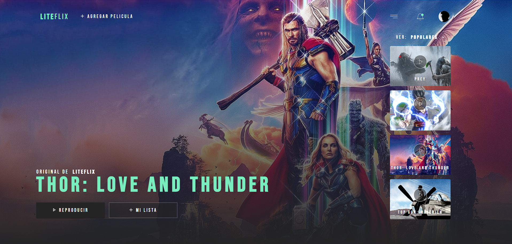
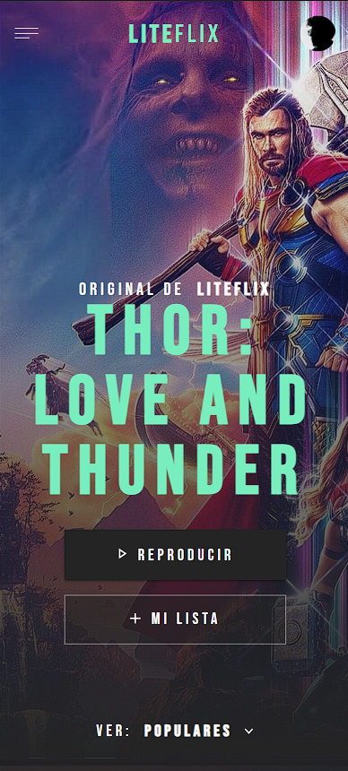

# PROJECT LITEFLIX

## Summary

This is a project that was developed for a technical interview, which aims to evaluate the skills of the programmer. It consists of building a web application inspired by netflix. It uses the "The MovieDB" API to obtain the data and the browser's localStorage to save the user's movie data.

Deployed in [VERCEL](https://liteflix-santibio.vercel.app/)

  
  

## Requirements

For development, you will only need Node.js installed on your environement.

### Node

[Node](http://nodejs.org/) is really easy to install & now include [NPM](https://npmjs.org/).
You should be able to run the following command after the installation procedure
below.

    $ node --version
    v0.10.24

    $ npm --version
    1.3.21

#### Node installation on OS X

You will need to use a Terminal. On OS X, you can find the default terminal in
`/Applications/Utilities/Terminal.app`.

Please install [Homebrew](http://brew.sh/) if it's not already done with the following command.

    $ ruby -e "$(curl -fsSL https://raw.github.com/Homebrew/homebrew/go/install)"

If everything when fine, you should run

    brew install node

#### Node installation on Linux

    sudo apt-get install python-software-properties
    sudo add-apt-repository ppa:chris-lea/node.js
    sudo apt-get update
    sudo apt-get install nodejs

#### Node installation on Windows

Just go on [official Node.js website](http://nodejs.org/) & grab the installer.
Also, be sure to have `git` available in your PATH, `npm` might need it.

---

## Install

    $ git clone https://github.com/Santibio/liteflix.git
    $ cd PROJECT
    $ npm install
## Configure app

Create a file called .env in the root of your project and add a REACT_APP_API_KEY=Your Api Key. Otherwise, you won't be able to connect to the API. You can generate one [here](https://developers.themoviedb.org/3/getting-started/introduction). 

    $ REACT_APP_API_KEY=<YOUR_API_KEY>

For more information about enviroments variables and React check this [page](https://create-react-app.dev/docs/adding-custom-environment-variables/).
 

## Start & watch

    $ npm start

## Simple build for production

    $ npm run build

## Update sources

Some packages usages might change so you should run `npm prune` & `npm install` often.
A common way to update is by doing

    $ git pull
    $ npm prune
    $ npm install

To run those 3 commands you can just do

    $ npm run pull

## Languages & tools

### HTML

- [Vanilla](https://developer.mozilla.org/es/docs/Web/HTML) for some templating.

### JavaScript

- [React](http://facebook.github.io/react) is used for UI.
- [Redux-Toolkit](https://redux-toolkit.js.org/) is used for managing global state.

### CSS

- [Material UI](https://mui.com/) is used for the pre-build components.
- [Styled Components](https://mui.com/) is used for style components faster.
